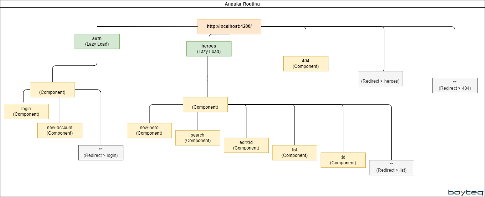

# AngularRouting

This project was generated with [Angular CLI](https://github.com/angular/angular-cli) version 16.0.2.

## Routing Diagram


## Higlighted Commits

| Detail                                                          | Command                                               |
|-------------------------------------------------------------------------|-------------------------------------------------------|
| [Enrutamiento: (178) Preparación del proyecto base.](https://github.com/HectorAndradeBayteq/angular-routing/commit/ac6f6ca176dd4ac0fd1bf05366bb50bf35523b94)                      | ```git checkout ac6f6ca176dd4ac0fd1bf05366bb50bf35523b94``` |
| [Enrutamiento: (179) Creación de componentes auth, heroes, material y …](https://github.com/HectorAndradeBayteq/angular-routing/commit/6f9cf8a920c2be6f0461a43d08f9815badee3c66)  | ```git checkout 6f9cf8a920c2be6f0461a43d08f9815badee3c66``` |
| [Enrutamiento: (179) Creación de componentes layout, login y register …](https://github.com/HectorAndradeBayteq/angular-routing/commit/8fe599e4176b0dd345f339c9ae9e166817b79559)  | ```git checkout 8fe599e4176b0dd345f339c9ae9e166817b79559``` |
| [Enrutamiento: (179) Creación de componentes hero, layout, list, new, …](https://github.com/HectorAndradeBayteq/angular-routing/commit/fa508cd0ecb7c1669b5721e1e2fa1204334f7f92)  | ```git checkout fa508cd0ecb7c1669b5721e1e2fa1204334f7f92``` |
| [Enrutamiento: (179) Ajustes en módulo Material.                       ](https://github.com/HectorAndradeBayteq/angular-routing/commit/982d41c06467c7c82554a6d990c27a614db1a40c)  | ```git checkout 982d41c06467c7c82554a6d990c27a614db1a40c``` |
| [Enrutamiento: (179) Ajustes en módulo Shared.                         ](https://github.com/HectorAndradeBayteq/angular-routing/commit/f5b02f55ba0f2a5adef83f4b47c66be56ec26572)  | ```git checkout f5b02f55ba0f2a5adef83f4b47c66be56ec26572``` |
| [Enrutamiento: (180) Definición de layout para el módulo auth y heroes.](https://github.com/HectorAndradeBayteq/angular-routing/commit/de5f21bbbbc10c6b4ea5af09bc40d9a355ad241f)  | ```git checkout de5f21bbbbc10c6b4ea5af09bc40d9a355ad241f``` |
| [Enrutamiento: (180) Definición de rutas principales (rutas padre).    ](https://github.com/HectorAndradeBayteq/angular-routing/commit/8e76120314aa940836518c7370b60a3eb203132b)  | ```git checkout 8e76120314aa940836518c7370b60a3eb203132b``` |
| [Enrutamiento: (181) Definición de rutas secundarias para heroes y aut…](https://github.com/HectorAndradeBayteq/angular-routing/commit/0c08c4c11f011ad55c6c7dfd455ba2632495e062)  | ```git checkout 0c08c4c11f011ad55c6c7dfd455ba2632495e062``` |
| [Enrutamiento: (181) Importación de RoutingModule y configuración rout…](https://github.com/HectorAndradeBayteq/angular-routing/commit/782ea56c0b73e029a85effec8d259d2f9b12304c)  | ```git checkout 782ea56c0b73e029a85effec8d259d2f9b12304c``` |

## Development server

Run `ng serve` for a dev server. Navigate to `http://localhost:4200/`. The application will automatically reload if you change any of the source files.

## Code scaffolding

Run `ng generate component component-name` to generate a new component. You can also use `ng generate directive|pipe|service|class|guard|interface|enum|module`.

## Build

Run `ng build` to build the project. The build artifacts will be stored in the `dist/` directory.

## Running unit tests

Run `ng test` to execute the unit tests via [Karma](https://karma-runner.github.io).

## Running end-to-end tests

Run `ng e2e` to execute the end-to-end tests via a platform of your choice. To use this command, you need to first add a package that implements end-to-end testing capabilities.

## Further help

To get more help on the Angular CLI use `ng help` or go check out the [Angular CLI Overview and Command Reference](https://angular.io/cli) page.
